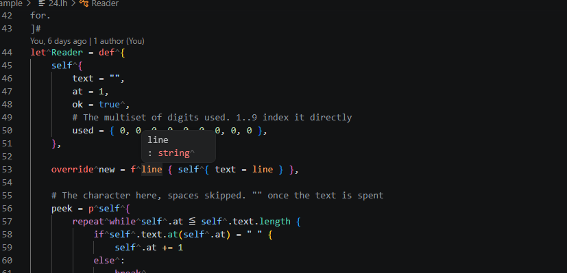
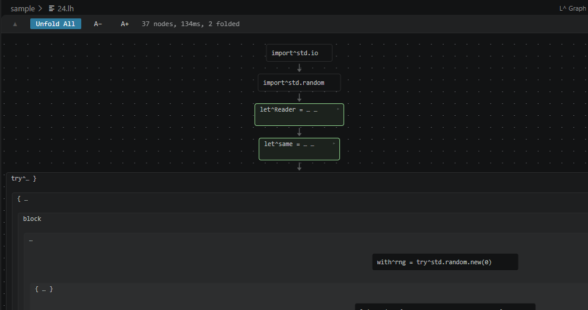

# L^ Language Support

[English](README.md) | **日本語**

[L^ (lhat)](https://github.com/SAM-tak/lhat) を Visual Studio Code で扱うための
拡張です。`.lh` または `.lton` ファイルを開くと、L^ の言語サーバー `lhatls` に
よる診断と各種言語機能を利用できます。





## インストール

Visual Studio Marketplace から **L^ Language Support** をインストールし、L^
ワークスペースを開いてください。Marketplace は使用中の環境に対応する
プラットフォーム別パッケージをインストールし、そこには対応する `lhatls` が
あらかじめ含まれています。別途言語サーバーを導入したり、エディターの起動時に
ネットワークから取得したりする必要はありません。

対応する VS Code のバージョンは 1.85 以降です。

汎用 VSIX を直接インストールした場合や、ソースから拡張を起動した場合は、
`lhat.serverPath` で言語サーバーを指定するか、`lhatls` を `PATH` に置いてください。

```json
{
  "lhat.serverPath": "/absolute/path/to/lhatls"
}
```

Windows では `lhatls.exe` を指定します。明示した設定は同梱サーバーより優先される
ため、ローカルでビルドしたサーバーを試す場合にも使えます。

## 機能

- L^ と LTON（`.lton`）の構文・セマンティックハイライト
- 編集中の型検査診断
- 補完、ホバー、定義へ移動、参照の検索、名前の変更
- ドキュメントシンボルとグラフ表示用アウトライン
- カーソル位置の名前について、完全な推論済み型をコピーする **Copy Signature**
- L^ ソースの読み取り専用グラフ表示
- L^ Debug Adapter Protocol 実装によるデバッグ

コマンドパレットから **L^: Show Graph View** を実行すると、`.lh` ファイルを
グラフ表示へ切り替えられます。**L^: Show Source** でテキストへ戻ります。
`lhat.graph.openBeside` を `true` にすると、グラフをエディター分割で開けます。

## L^ プログラムのデバッグ

言語サーバーは拡張に同梱されていますが、実行時ランタイムは意図的に別配布です。
プログラムの実行やデバッグには、[L^ のリリース](https://github.com/SAM-tak/lhat/releases)
から入手したスタンドアロンの `lhat` 実行ファイルを、`PATH` に置くか
`lhat.runtimePath` で指定する必要があります。

```json
{
  "lhat.runtimePath": "C:\\path\\to\\lhat.exe"
}
```

`.lh` ファイルをアクティブにして <kbd>F5</kbd> を押すと、デバッガーで実行します。
ブレークポイント、ステップ実行、変数表示、式の評価、条件付きブレークポイント、
プログラム出力は、通常の VS Code デバッグビューから利用できます。繰り返し使う
構成は、次のように `launch.json` へ書けます。

```json
{
  "type": "lhat",
  "request": "launch",
  "name": "現在の L^ プログラムを実行",
  "program": "${file}",
  "cwd": "${workspaceFolder}",
  "args": [],
  "stopOnEntry": false,
  "relaxed": false
}
```

## ワークスペース設定

既定では `lhatls` がワークスペース内の L^ ファイルを検査します。ワークスペースの
ルートに `lhat-lsp.json` を置くと、生成物・ベンダーコードの除外、特定の生成済み
ソースの維持、relaxed 実行でのみ許される診断の警告化を指定できます。

```json
{
  "exclude": ["build/", "**/node_modules/"],
  "force_include_files": ["build/generated/api.lh"],
  "strict": false
}
```

埋め込み先のホストが独自の L^ API を登録している場合は、言語サーバーにも同じ API
を知らせるため、ワークスペースのルートに `lhat-host.json` を生成します。

```sh
lhat --dump-host-api lhat-host.json
```

生成されたファイルは解析用の登録情報だけを記録し、ホストのコールバックを実行する
ものではありません。ホスト API を変えた際には再生成してください。

## 設定

| 設定 | 既定値 | 用途 |
| --- | --- | --- |
| `lhat.serverPath` | 空 | 同梱言語サーバーを任意のパスで置き換えます。同梱されない場合は `PATH` 上の `lhatls` を使います。 |
| `lhat.serverAutoRestart` | `true` | 予期せず停止したサーバーを再起動します。Windows でローカルサーバーを繰り返しビルドする間だけ無効にできます。 |
| `lhat.runtimePath` | 空 | 実行・デバッグに使うスタンドアロン `lhat` ランタイムへのパスです。 |
| `lhat.graph.openBeside` | `false` | 現在のエディターを置き換えず、エディター分割にグラフを開きます。 |

## 開発

拡張自体は TypeScript プロジェクトです。Extension Development Host で動かすには:

```sh
npm ci
npm run compile
```

このリポジトリを VS Code で開き、<kbd>F5</kbd> を押してください。
[L^ リポジトリ](https://github.com/SAM-tak/lhat)で `lhatls` をビルドし、
`lhat.serverPath` にその実行ファイルを指定します。Windows でサーバーを再ビルド
する間は、古いプロセスがリンク前に起動されないよう `lhat.serverAutoRestart` を
`false` に設定してください。

ローカルで汎用 VSIX を作るには:

```sh
npm run package
```

この汎用パッケージにはネイティブバイナリを意図的に含めません。release workflow が
`lhatls` を同梱したプラットフォーム別パッケージを生成します。

## ライセンス

Apache-2.0。詳しくは [LICENSE](LICENSE) を参照してください。
